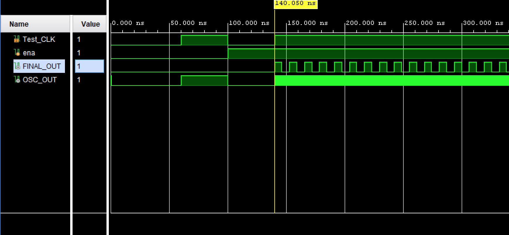

<!---

This file is used to generate your project datasheet. Please fill in the information below and delete any unused
sections.

You can also include images in this folder and reference them in the markdown. Each image must be less than
512 kb in size, and the combined size of all images must be less than 1 MB.
-->

## How it works

A ring oscillator working in the GHz range is divided to give an observable output frequency in the 20 MHz range.

Top-Level Complete Mixed-Signal Functionality Verification in Verilog

PEX Sims Verifying Performance

## How to test

A supply current of 1-2 mA when enable is high indicates that the ring oscillator is functional. The final output can be observed in the 20 MHz range. Test/debug mode verifies the divider functionality at low frequency. The ring oscillator can be disabled by on-chip signals (ena = low).

## External hardware

Oscilloscope (100 MHz), power supply, function generator (10 MHz, digital).
